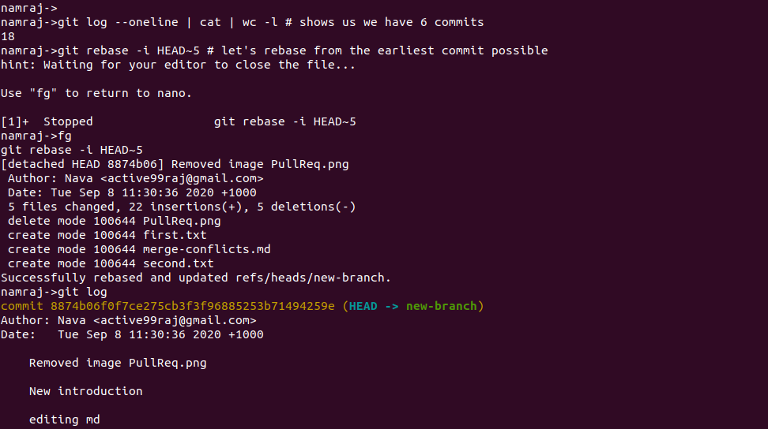

# Differenct Flags :flower: 

## -i flag :rainbow:

    1. ssh connection with server EC2, 
    2. scp -i  file transfer, git rebase -i HEAD~5 cleaning commit history, 
    3. sed -ie ‘s/&/ /g’ stream editing and text transformation etc.
Flag -i is used with SSH, SCP, sed, and git rebase so far seen , so I am writing it here for reference.    
Before you try to SSH make sure that your instance is running and that the checks have passed. This should involve typing something along the lines of   

    ```
    $ ssh -i ./me-key-pair-uswest2.pem ec2-user@YOUR_PUBLIC_DNS
    $ scp -i ./me-key-pair-uswest2.pem move.txt ec2-user@ec2-54-213-7-226.us-west-2.compute.amazonaws.com:/
    $ namraj->git rebase -i HEAD~5 # let's rebase from the earliest commit possible
    $ sed -ie ‘s/&/ -/g’   :smile:
    ```
## -R -rf -h -a -r -p on different contexts
\-p flag is used with parent directory  
\-rf flag with rm to remove directory.  
\-r with cp      
\-R with chmod directory
\-a used with ls, ps, git add, and more.
\-h with du, df, free  



:wink: Have a great day!!!


